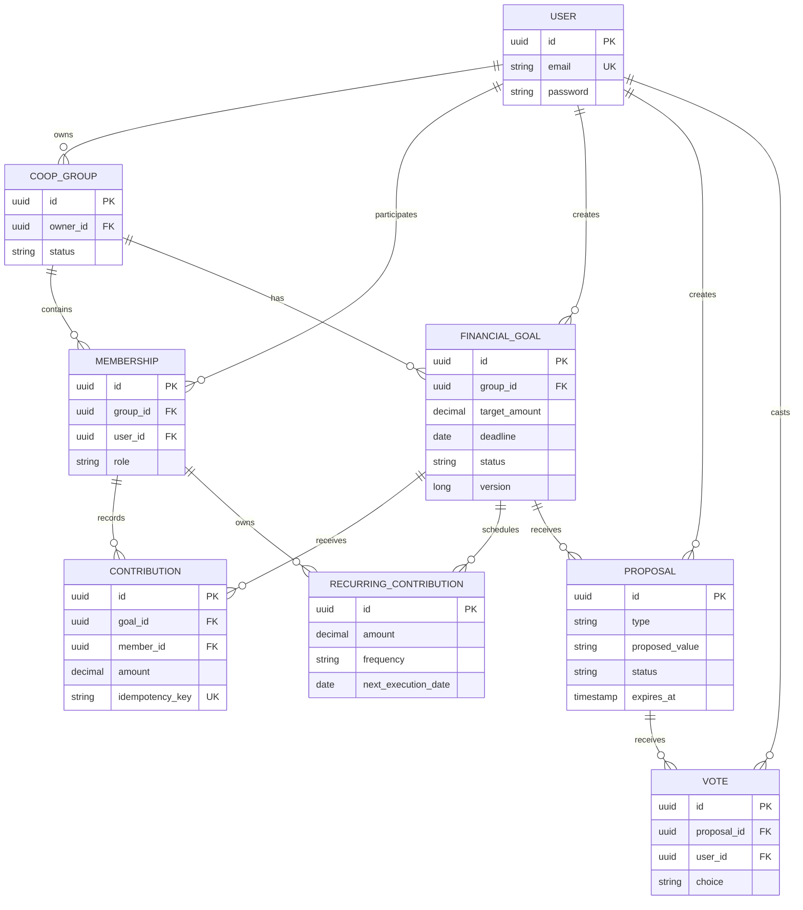
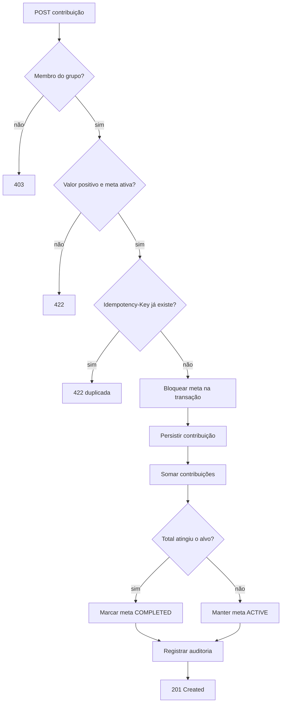
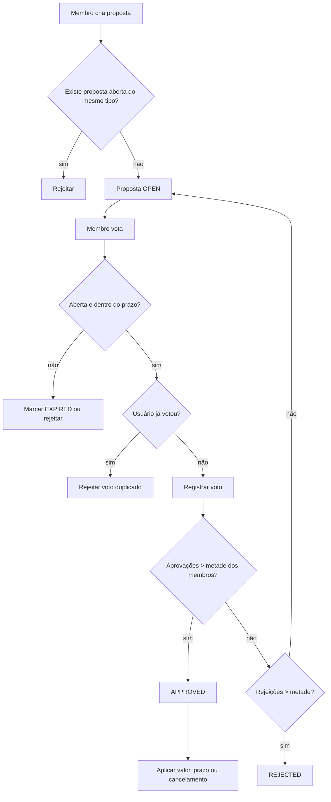

# CoopGoal API

API REST para criar e acompanhar metas financeiras colaborativas. O CoopGoal organiza grupos, participantes, metas, contribuições simuladas, recorrências e decisões coletivas por votação.

## Problema resolvido

Planejar uma viagem, um evento ou um fundo compartilhado costuma espalhar informações entre planilhas e mensagens. O CoopGoal centraliza o objetivo, o histórico de contribuições e as decisões que alteram a meta, com autorização por grupo, idempotência e trilha de auditoria.

## Funcionalidades

- Cadastro, login e autenticação JWT stateless.
- Grupos com papéis `OWNER`, `ADMIN` e `MEMBER`.
- Metas com valor-alvo, prazo, progresso calculado e extrato paginado.
- Contribuições simuladas idempotentes e conclusão automática da meta.
- Contribuições recorrentes semanais ou mensais processadas por agendamento.
- Propostas para alterar valor, prazo ou cancelar uma meta.
- Voto único por participante e aprovação por maioria simples.
- Dashboard pessoal com grupos, metas, total contribuído, recorrências e pendências.
- Auditoria de alterações relevantes, correlation ID e métricas operacionais.
- OpenAPI/Swagger, Flyway, Docker, Testcontainers e GitHub Actions.

## Tecnologias

- Java 21 e Spring Boot 3.5
- Spring Web, Data JPA, Security, Validation e Actuator
- JWT com JJWT e senhas BCrypt
- PostgreSQL 17 e Flyway
- springdoc-openapi
- JUnit 5, Mockito e Testcontainers
- Maven, Docker Compose e GitHub Actions

## Arquitetura

O projeto é organizado por domínio. Cada módulo contém apenas as divisões necessárias (`controller`, `service`, `repository`, `domain`, `dto` e `exception`). Controllers traduzem HTTP; serviços concentram regras e transações; repositórios isolam persistência; entidades protegem transições de estado.

```text
coopgoal-api/
├── .github/workflows/ci.yml
├── src/main/java/com/coopgoal
│   ├── auth/                 # cadastro e login
│   ├── user/                 # perfil e dashboard
│   ├── group/                # grupos, membros e autorização por papel
│   ├── goal/                 # metas e progresso
│   ├── contribution/         # contribuições e recorrências
│   ├── proposal/             # propostas e votos
│   ├── audit/                # trilha de auditoria
│   ├── security/             # JWT e configuração Spring Security
│   └── shared/               # erros, OpenAPI, tempo e correlation ID
├── src/main/resources
│   ├── db/migration/V1__create_schema.sql
│   ├── application.yml
│   └── application-dev.yml
├── src/test/java/com/coopgoal
│   ├── integration/          # PostgreSQL real com Testcontainers
│   └── .../service/          # regras de negócio com Mockito
├── Dockerfile
├── docker-compose.yml
└── pom.xml
```

### Decisões técnicas

- `UUID` evita IDs previsíveis e facilita integração entre serviços.
- `BigDecimal` e `NUMERIC(19,2)` preservam precisão monetária.
- O total arrecadado não existe em `FinancialGoal`; é sempre somado de `Contribution`.
- Contribuições bloqueiam a meta durante a transação e a entidade também possui `@Version`.
- Idempotência e voto único são validados no serviço e protegidos por constraints no PostgreSQL.
- Uma proposta aprovada aplica a mudança na mesma transação do voto decisivo.
- Alterações diretas em valor, prazo e cancelamento não são expostas no `PATCH`; passam por proposta.
- Cada recorrência é processada em transação independente. Uma falha gera log e métrica sem interromper as demais.
- `spring.jpa.hibernate.ddl-auto=validate` impede que a aplicação altere o esquema silenciosamente.
- DTOs são os únicos contratos HTTP; entidades JPA não são serializadas pela API.

## Modelo de dados



## Fluxos principais

### Registro de contribuição



### Proposta e votação



## Regras de negócio relevantes

- Apenas membros visualizam dados de um grupo.
- Apenas `OWNER` e `ADMIN` criam ou editam metas.
- Valor-alvo e contribuição devem ser maiores que zero; o prazo deve ser futuro.
- Metas concluídas ou canceladas não recebem contribuições.
- A meta é concluída automaticamente quando a soma atinge o valor-alvo.
- Uma chave de idempotência registra no máximo uma contribuição.
- Um usuário vota no máximo uma vez por proposta.
- Votos após a expiração são rejeitados.
- Só pode existir uma proposta aberta do mesmo tipo por meta.
- Cancelamento, mudança de prazo e mudança de valor passam por votação.
- Aprovação exige mais da metade de todos os membros atuais do grupo.

## Executar com Docker

Pré-requisito: Docker Desktop ou Docker Engine com Compose.

```bash
cp .env.example .env
```

Edite `.env`, principalmente `JWT_SECRET`, usando ao menos 32 caracteres aleatórios. Depois:

```bash
docker compose up --build
```

A API ficará em `http://localhost:8080` e o PostgreSQL em `localhost:5432`.

Para encerrar:

```bash
docker compose down
```

Use `docker compose down -v` somente quando também quiser apagar os dados locais.

## Executar com Java e Maven

Pré-requisitos: Java 21, Maven 3.9+ e PostgreSQL.

```bash
export DB_URL=jdbc:postgresql://localhost:5432/coopgoal
export DB_USERNAME=coopgoal
export DB_PASSWORD=coopgoal-local
export JWT_SECRET=replace-with-at-least-32-random-characters
mvn spring-boot:run
```

No PowerShell, use `$env:NOME_DA_VARIAVEL="valor"` para definir cada variável.

## Variáveis de ambiente

| Variável | Obrigatória | Padrão local | Descrição |
|---|---:|---|---|
| `DB_URL` | não | `jdbc:postgresql://localhost:5432/coopgoal` | JDBC do PostgreSQL |
| `DB_USERNAME` | não | `coopgoal` | usuário do banco |
| `DB_PASSWORD` | não | `coopgoal-local` | senha do banco |
| `JWT_SECRET` | sim | somente no Compose local | segredo HMAC com 32+ caracteres |
| `JWT_EXPIRATION` | não | `PT8H` | duração ISO-8601 do token |
| `SPRING_PROFILES_ACTIVE` | não | `prod` no Compose | perfil Spring |
| `RECURRING_FIXED_DELAY` | não | `PT1H` | intervalo do agendador |

Nunca versione `.env`, tokens ou credenciais reais.

## Dados de desenvolvimento

Ative `SPRING_PROFILES_ACTIVE=dev` para carregar uma base idempotente de exemplo:

- `ana@coopgoal.dev`
- `bruno@coopgoal.dev`
- `carla@coopgoal.dev`
- senha local comum: `Senha123!`
- um grupo, duas metas, três contribuições, uma recorrência e uma proposta aberta

O carregador usa `@Profile("dev")` e nunca executa no perfil de produção.

## Swagger e observabilidade

- Swagger UI: `http://localhost:8080/swagger-ui.html`
- OpenAPI JSON: `http://localhost:8080/v3/api-docs`
- Health check: `http://localhost:8080/actuator/health`
- Métricas: `http://localhost:8080/actuator/metrics`

Os logs são JSON estruturado. Toda resposta inclui `X-Correlation-ID`; quando o cliente envia esse header, o mesmo valor percorre a requisição. Senhas e tokens não são registrados.

## Exemplos com curl

Os exemplos abaixo usam `http://localhost:8080`. Copie o `accessToken` do cadastro/login para `TOKEN`, e os IDs retornados para as demais variáveis.

### Cadastrar usuário

```bash
curl -X POST http://localhost:8080/api/auth/register \
  -H "Content-Type: application/json" \
  -d '{"name":"Ana Silva","email":"ana@example.com","password":"SenhaForte@123"}'
```

### Realizar login

```bash
curl -X POST http://localhost:8080/api/auth/login \
  -H "Content-Type: application/json" \
  -d '{"email":"ana@example.com","password":"SenhaForte@123"}'
```

```bash
TOKEN="cole-o-accessToken-aqui"
```

### Criar grupo

```bash
curl -X POST http://localhost:8080/api/groups \
  -H "Authorization: Bearer $TOKEN" \
  -H "Content-Type: application/json" \
  -d '{"name":"Viagem para o Chile","description":"Despesas da viagem"}'
```

### Criar meta

```bash
GROUP_ID="uuid-do-grupo"

curl -X POST "http://localhost:8080/api/groups/$GROUP_ID/goals" \
  -H "Authorization: Bearer $TOKEN" \
  -H "Content-Type: application/json" \
  -d '{"name":"Passagens","description":"Ida e volta","targetAmount":12000.00,"deadline":"2027-06-30"}'
```

### Registrar contribuição

```bash
GOAL_ID="uuid-da-meta"

curl -X POST "http://localhost:8080/api/goals/$GOAL_ID/contributions" \
  -H "Authorization: Bearer $TOKEN" \
  -H "Idempotency-Key: contribution-ana-2026-08-01" \
  -H "Content-Type: application/json" \
  -d '{"amount":250.00,"description":"Contribuição de agosto"}'
```

### Criar proposta

```bash
curl -X POST "http://localhost:8080/api/goals/$GOAL_ID/proposals" \
  -H "Authorization: Bearer $TOKEN" \
  -H "Content-Type: application/json" \
  -d '{"type":"CHANGE_TARGET_AMOUNT","proposedValue":"15000.00","justification":"Nova cotação","expiresAt":"2026-08-10T18:00:00Z"}'
```

Para `CHANGE_DEADLINE`, envie a data ISO em `proposedValue`. Para `CANCEL_GOAL`, omita `proposedValue`.

### Votar

```bash
PROPOSAL_ID="uuid-da-proposta"

curl -X POST "http://localhost:8080/api/proposals/$PROPOSAL_ID/votes" \
  -H "Authorization: Bearer $TOKEN" \
  -H "Content-Type: application/json" \
  -d '{"choice":"APPROVE"}'
```

### Paginação e filtros

```bash
curl "http://localhost:8080/api/groups/$GROUP_ID/goals?status=ACTIVE&name=passagens&page=0&size=10&sort=createdAt,desc" \
  -H "Authorization: Bearer $TOKEN"
```

Filtros adicionais: `deadlineFrom`, `deadlineTo`, status da proposta e `from`/`to` para período das contribuições.

## Erros

Erros de domínio e validação seguem um contrato único:

```json
{
  "timestamp": "2026-08-03T10:00:00Z",
  "status": 400,
  "error": "Bad Request",
  "code": "GOAL_INVALID_DEADLINE",
  "message": "A data limite deve ser futura",
  "path": "/api/groups/00000000-0000-0000-0000-000000000000/goals",
  "fieldErrors": []
}
```

## Testes

```bash
mvn test
```

A suíte cobre regras unitárias com Mockito e fluxos de integração com um PostgreSQL descartável via Testcontainers. Docker precisa estar ativo para os testes de integração; sem Docker, eles são ignorados explicitamente, enquanto os testes unitários continuam executando.

## CI

O workflow `.github/workflows/ci.yml` usa Java 21, cache do Maven e executa:

```bash
mvn -B clean verify
```

Qualquer falha de compilação ou teste interrompe o pipeline.
